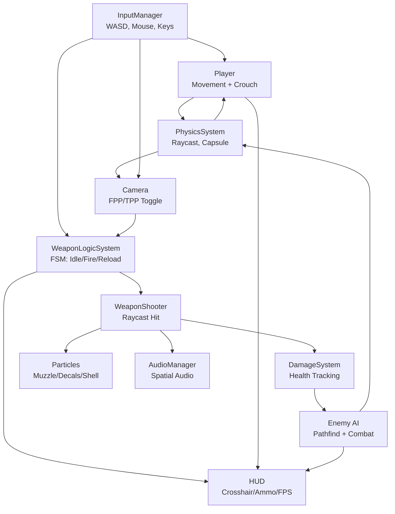

# FPP + TPP Browser FPS Starter

A Three.js + Rapier + TypeScript starter inspired by the NotStrike template, with
**both first-person and third-person views** toggleable on a key. Built for the
browser (~953 KB gzipped first load, with maps lazy-loaded) using a Mixamo-rigged humanoid for the TPP
character.

```
npm install
npm run dev
```

Open http://localhost:5173, click the canvas to lock the pointer, and you're in.

## Controls

| Key   | Action                  |
|-------|-------------------------|
| WASD  | Move                    |
| Shift | Sprint                  |
| Space | Jump                    |
| Ctrl / C | Crouch              |
| R     | Reload                  |
| 1/2/3 | Equip AK / pistol / knife |
| LMB   | Fire                    |
| **RMB** | **Aim Down Sights (ADS)** |
| **V** | **Toggle FPP ↔ TPP**     |
| **M** | **Reopen map menu**      |

**Debug controls** (when `?debug` is in the URL or `localStorage.debug` is set):

| Key   | Action                  |
|-------|-------------------------|
| F7    | Toggle player debugger  |

## Architecture

```
src/
├── main.ts                 Bootstrap, fixed-step physics loop, view toggle wiring
├── Renderer.ts             WebGLRenderer + HUD canvas overlay
├── Scene.ts                Lights, sky, GLB map → trimesh colliders, lazy map loader
├── PhysicsSystem.ts        Rapier 3D world, raycast, spherecast
├── InputManager.ts         Pointer Lock + edge-triggered keys
├── Camera.ts               FPP/TPP rig; spherecast back-off for TPP camera
├── Player.ts               Quake-style PM_Accelerate on a dynamic capsule
├── MapMenu.ts              Map selection UI (metadata-only, lazy-loaded)
├── HUD.ts                  2D crosshair, ammo, fps overlay
├── weapon/
│   ├── WeaponData.ts          AK / pistol / knife stats + per-mode offsets
│   ├── WeaponLogicSystem.ts   Idle / Firing / Reloading / Switching FSM
│   ├── WeaponRenderer.ts      Loads each GLB once; reparents on V toggle
│   └── WeaponShooter.ts       Raycast + impact / decal / shell / muzzle FX
├── particle/
│   ├── GLSLParticleSystem.ts        Custom shader Points; muzzle / smoke
│   ├── BulletInstancedParticleSystem.ts InstancedMesh brass shells
│   ├── DecalSystem.ts               Bullet-hole decals (FIFO, fade)
│   └── ImpactParticle.ts            Debris cone along surface normal
├── character/
│   ├── ThirdPersonCharacter.ts   Loads Mixamo Y Bot + anims; spine aim
│   ├── CharacterAnimator.ts      Layered AnimationMixer (loco + additive overlays)
│   ├── locomotionBindings.ts     Map Mixamo animation names to in-engine states
│   ├── locomotionConstants.ts    Movement constants, speeds, accelerations
│   ├── rigHelpers.ts             Bone lookup, transform helpers
│   ├── characterAssets.ts        Asset paths and metadata
│   └── ThirdPersonCharacter.ts   Main controller
├── animation/
│   ├── AnimationSystem.ts    MarkerWatcher: time-based animation events
│   └── FPSMesh.ts            FPP arms placeholder; recoil spring
├── audio/
│   └── AudioManager.ts       Spatial audio, weapon fire, footsteps, ambient
├── ai/
│   ├── Enemy.ts              Enemy character controller, state machine
│   ├── CharacterPool.ts      Object pool for enemy instances
│   ├── DamageSystem.ts       Damage callbacks, health tracking
│   └── NavGrid.ts            Pathfinding grid for waypoint navigation
├── maps/
│   ├── index.ts              Metadata registry + lazy loader (loadMap function)
│   ├── shootRange.ts         Kenney prop-based map
│   ├── suburbanStreet.ts     Kenney prop-based map
│   ├── industrialYard.ts     Kenney prop-based map
│   ├── ghostCity.ts          Monolithic GLB map
│   ├── deathmatch1.ts        Pre-authored TDM arena
│   └── deathmatch2.ts        Pre-authored TDM arena
├── modes/
│   └── TdmMatch.ts           Team Deathmatch game mode logic
├── common/
│   └── math.ts               Utility math functions (clamp, lerp, etc.)
├── debug/
│   ├── log.ts                Debug logging with toggles
│   ├── PlayerDebugger.ts     Visual debugging for player physics
│   └── WeaponTransformDebugger.ts Bone and weapon position visualization
├── setup/
│   ├── mapFlow.ts            Map selection and loading flow
│   ├── matchController.ts    Match lifecycle and state management
│   ├── hudState.ts           HUD text and state updates
│   ├── particles.ts          Particle system initialization
│   ├── spriteFx.ts           Sprite FX system setup
│   ├── weaponHitHandlers.ts  Weapon impact handlers (decals, damage)
│   ├── enemyCombat.ts        Enemy AI combat setup
│   ├── enemyLifecycle.ts     Enemy spawning and cleanup
│   ├── audio.ts              Audio system initialization
│   ├── muzzleFx.ts           Muzzle flash FX setup
│   └── devBots.ts            Dev mode bot spawning
```

**Key architectural changes:**

- **Maps** (`src/maps/index.ts`): Now uses a lazy-loader pattern. `MapMeta` (id, name, description) is metadata-only; `loadMap(id)` dynamically imports the full `MapDefinition` on demand.
- **Scene.ts**: Now calls `loadMap()` instead of eagerly importing all maps.
- **MapMenu.ts**: Shows only metadata from the registry; actual map code loads when selected.
- **Setup folder**: Initialization code for various systems (match flow, HUD, particles, enemies, audio).
- **AI folder**: Enemy spawning, character pooling, damage tracking, navigation.
- **Debug folder**: Optional visualization tools for development.


## Feature workflow



## Map Studio — Visual Level Editor

You can visually place enemies, spawn points, waypoints, and props using the **Map Studio** — a standalone 3D editor that runs in your browser alongside the dev server.

```
npm run dev        # Start the game
npm run studio     # Prints the URL — open it in Chrome
```

Then open **http://localhost:5173/studio/**.

### File structure
The studio is a proper TypeScript project under `src/studio/` with its own HTML entry at `studio/index.html`. Vite serves it as a multi-page build (configured in `vite.config.ts`):

```
studio/
  index.html              ← Studio HTML shell
src/studio/
  index.ts                ← Entry — wires everything
  state.ts                ← Global state object
  types.ts                ← Entity class, types
  scene.ts                ← Three.js init, lights, grid
  entities.ts             ← createEntity, properties panel
  selection.ts            ← Single/multi-select, selection box
  tools.ts                ← Active tool + ghost preview
  palette.ts              ← Kenney catalog → palette DOM
  undo.ts                 ← Undo/redo
  waypoints.ts            ← Patrol route lines
  importexport.ts         ← Export/import layout JSON
  ui.ts                   ← Status bar
  styles.ts               ← CSS injection
```

### What you can do

| Feature | How |
|---|---|
| **Place enemies** | Click "Enemy Spawn" in palette → click on the map |
| **Create patrol routes** | Click "Waypoint" → click multiple points → blue lines connect them |
| **Place buildings/props** | Full Kenney asset catalog with search (industrial, suburban, walls, roads) |
| **Multi-select** | Shift+click or drag a selection box |
| **Move/scale/rotate** | Drag to move, properties panel for exact values |
| **Undo/Redo** | Ctrl+Z / Ctrl+Y |
| **Export as JSON** | One button → save as `public/assets/maps/<mapId>.layout.json` |

The exported `.layout.json` is loaded automatically when you refresh the game — enemies spawn exactly where you placed them.

For detailed instructions see `studio/README.md` (alongside the studio entry).

## How FPP and TPP stay in sync

A single weapon `Object3D` is reparented when you press V:

  - **FPP**: parented to `cam.three → fpsMesh.weaponAttach`
  - **TPP**: parented to `character.rightHand` (the `mixamorigRightHand` bone)

The crosshair raycast always uses `camera.three.position` and the camera-forward
direction, so shooting behavior is identical in both views — only what you *see*
changes. In TPP, `applySpineAim(pitch)` adds an additive rotation to the
`mixamorigSpine1` / `mixamorigSpine2` bones so the upper body actually points at
where the crosshair is.

## Asset setup (you provide)

The game runs out of the box with primitive placeholders. Drop these in to upgrade:

### Map

```
public/assets/maps/dust.glb         (Y-up, 1 unit = 1 m, every mesh → trimesh collider)
```

### Mixamo character

1. Go to **[mixamo.com](https://www.mixamo.com)** → sign in (free Adobe account)
2. Pick **"Y Bot"** and download:
   - Format: **glTF Binary (.glb)** (or FBX → convert with `fbx2gltf`)
   - Skin: **WITH SKIN**
   - Save as `public/assets/character/ybot.glb`
3. For each animation below, search Mixamo, click Download:
   - Format: **glTF Binary (.glb)**
   - Skin: **WITHOUT SKIN** ← reuses Y Bot's skeleton, no retargeting needed
   - FPS: 30, Keyframe Reduction: none
4. Save under `public/assets/character/animations/`:

| File                  | Mixamo search term       |
|-----------------------|--------------------------|
| `idle.glb`            | Idle                     |
| `walk_forward.glb`    | Walking                  |
| `run_forward.glb`     | Running                  |
| `strafe_left.glb`     | Left Strafe Walking      |
| `strafe_right.glb`    | Right Strafe Walking     |
| `walk_backward.glb`   | Walking Backwards        |
| `jump.glb`            | Jumping                  |
| `firing_rifle.glb`    | Firing Rifle             |
| `reload_rifle.glb`    | Reload Rifle             |

5. Rename `public/assets/character/manifest.json.example` → `manifest.json`.

The runtime fetches `manifest.json`; if it's missing, you get the placeholder
humanoid. Adding more animations is data-only — extend the manifest and the
bindings in `ThirdPersonCharacter.load()`.

## Maps

Drop GLBs into `public/assets/maps/` or add new map modules under `src/maps/`. Maps are **lazy-loaded** — only metadata is in the initial bundle:

1. **Metadata-only import** in `MapMenu.ts`:
   ```typescript
   import { MAPS } from './maps'  // Only id, name, description
   ```

2. **Dynamic import** in `Scene.ts` when a map is selected:
   ```typescript
   const mod = await loadMap(id)  // Full map module loaded on-demand
   ```

### Adding a new map

1. Create `src/maps/myMap.ts`:
   ```typescript
   import type { MapDefinition } from './index'
   
   export const myMap: MapDefinition = {
     id: 'myMap',
     name: 'My Map',
     description: 'Description here',
     scene: { groundSize: 220, groundColor: 0x6d7c62 },
     async build(b) {
       // Place props and set up the map
       await b.place('./assets/kenney/roads/tile-low.glb', [0, 0, 0], 0, 1)
     }
   }
   ```

2. Add to the loader switch in `src/maps/index.ts`:
   ```typescript
   export async function loadMap(id: string): Promise<MapDefinition | null> {
     switch (id) {
       case 'myMap':
         return (await import('./myMap')).myMap
       // ...
     }
   }
   ```

3. Add metadata to `MAPS` array in `src/maps/index.ts`:
   ```typescript
   export const MAPS: MapMeta[] = [
     { id: 'myMap', name: 'My Map', description: 'Description here' },
     // ...
   ]
   ```

Each map becomes a separate JS chunk (typically 0.2–3 KB gzipped) and only loads when selected.

## Weapons

Drop GLBs into `public/assets/weapons/ak47.glb` etc. If absent, a chunky
primitive rifle is rendered. Adjust `fppOffset` / `tppOffset` in
`src/weapon/WeaponData.ts` so the model sits naturally in the hand and in front
of the camera.

## Inspecting a GLB

```
npx tsx scripts/inspect-glb.ts public/assets/character/ybot.glb
```

Lists animation clips, bone node names, and skins — useful to confirm the
exact Mixamo bone names you got and adjust `WeaponData.ts` offsets.

## Build configuration

The `vite.config.ts` includes optimizations for production builds:

```typescript
build: {
  target: 'es2022',
  sourcemap: false,
  chunkSizeWarningLimit: 2100,  // Accommodate Rapier (2,055 KB)
  rollupOptions: {
    output: {
      manualChunks(id) {
        // Split Three.js and Rapier into separate chunks
        if (id.includes('three')) return 'three'
        if (id.includes('@dimforge/rapier3d-compat')) return 'rapier'
      },
      codeSplitting: true  // Enable explicit code-splitting
    }
  }
}
```

Maps are dynamically imported and automatically split into separate chunks by Rollup.

## Rapier WASM note

This template uses **`@dimforge/rapier3d-compat`**, which inlines the WASM as
base64 (≈ 760 KB gzipped). No extra Vite plugins. If you switch to the
non-`-compat` `@dimforge/rapier3d`, you'll need `vite-plugin-wasm` +
`vite-plugin-top-level-await`.

## Bundle size & optimization

Latest production build (with lazy-loaded maps):

```
Initial load:
  dist/assets/index-*.js       ~31 KB gz   (app + menu code)
  dist/assets/three-*.js      ~150 KB gz   (Three.js + GLTFLoader)
  dist/assets/rapier-*.js     ~772 KB gz   (Rapier WASM, base64-embedded)
                              ───────────
                              ~953 KB gz first load

Lazy-loaded on map selection:
  dist/assets/shootRange-*.js        ~1 KB gz
  dist/assets/suburbanStreet-*.js    ~1 KB gz
  dist/assets/industrialYard-*.js    ~1 KB gz
  dist/assets/ghostCity-*.js       ~0.2 KB gz
  dist/assets/deathmatch1-*.js     ~0.2 KB gz
  dist/assets/deathmatch2-*.js     ~0.2 KB gz
```

### Optimization details

- **Maps are lazy-loaded**: Only metadata (id, name, description) is in the initial bundle. The actual map code loads when the user selects a map from the menu.
- **Code-splitting enabled**: Vite automatically splits large dependencies (Three.js, Rapier) into separate chunks.
- **Dynamic imports**: Map modules use dynamic `import()`, keeping them out of the initial bundle.
- **GLB assets**: Character, weapons, and map GLB files are fetched on-demand and don't count against the bundle.

## License

MIT — go nuts.
